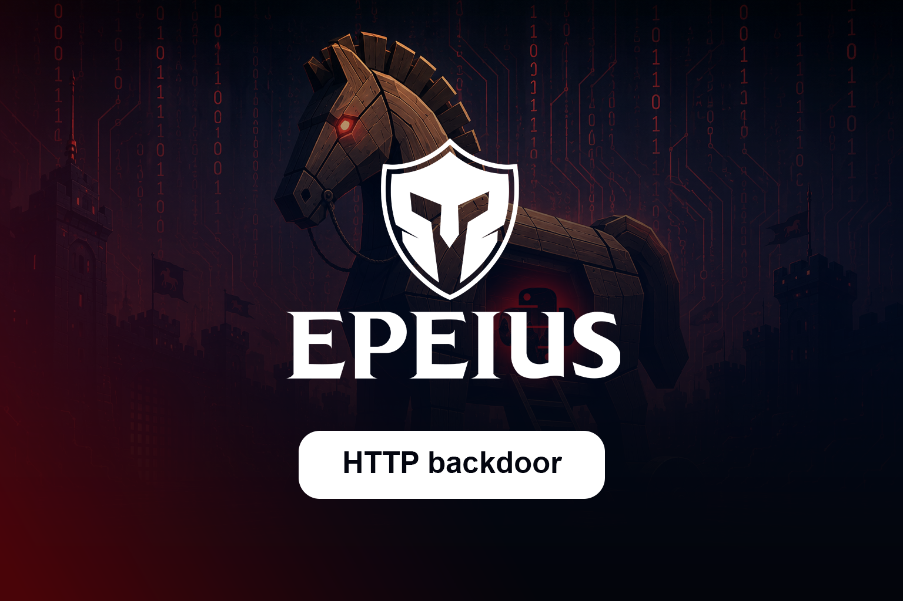

# HTTP Remote Administration Agent (Educational C2 Client)

[](LICENSE)
[](https://python.org)
[]()

Este repositorio contiene un agente de administración remota basado en HTTP (C2 Client) desarrollado en Python para sistemas Windows. El proyecto simula el comportamiento de un implante de malware avanzado para su análisis en entornos controlados de laboratorio, entrenamiento de Red Teaming y desarrollo de firmas de detección y respuesta ante incidentes (Blue Teaming).

## ⚠️ Descargo de Responsabilidad (Disclaimer)

**EL USO DE ESTE SOFTWARE SIN CONSENTIMIENTO PREVIO ES ILEGAL.** 
Este proyecto ha sido creado exclusivamente con fines educativos, de investigación de malware y auditorías de seguridad autorizadas. El desarrollador no se hace responsable del mal uso, daños o acciones legales derivadas de la utilización de este código.

---

## ✨ Características del Agente

El agente realiza consultas periódicas (polling) a un servidor central y cuenta con los siguientes módulos de telemetría, persistencia y control:

* **Tunelización Reversa Integrada:** Configurado de manera nativa para interactuar con proxies y servicios de tunelización pública (como **ngrok**) para evadir restricciones de NAT o firewalls perimetrales.
* **Evasión por Camuflaje (Masquerading):** Copia autónoma del binario/script dentro de directorios legítimos de aplicaciones de terceros (`AppData\Local\Google\Chrome\User Data`) para burlar inspecciones rutinarias.
* **Persistencia Dual (Instalación/Remoción):** Funciones nativas para inyectar y remover llaves de ejecución automática en el registro de Windows sin privilegios elevados.
* **Ejecución Remota de Comandos:** Shell interactivo a través de subprocesos del sistema.
* **Keylogger Integrado:** Registro asíncrono de pulsaciones de teclado (utilizando la librería `pynput`).
* **Captura Multimedia:** Toma de screenshots y fotos de la webcam local (`cv2`) codificados en Base64.
* **Manipulación de Archivos:** Capacidades de descarga (Exfiltración), subida (Instalación), copia, movimiento y eliminación de archivos en la máquina objetivo.
* **Reconocimiento del Entorno (Discovery):** Extracción de metadatos del sistema y auditoría de soluciones de seguridad locales (Antivirus y Firewall mediante consultas WMI).

---

## 🔒 Mecanismos de Persistencia y Evasión (Execution Flow)

Al ejecutarse el script en el Endpoint, el bloque de control principal (`__main__`) activa el siguiente flujo de toma de decisiones automatizado:

Usa el código con precaución.[ Inicio del Script ]│¿Existe la llave HKCU 'backdoor'?/                         (Sí)                         (No)│                             │[Alerta de Seguridad]          [Fase de Infección]Protocolo de contención         1. Obtiene USERNAME actual.2. Autocopia el script en:AppData\Local\Google\Chrome\User Data3. Inyecta llave "Chrome security guard".4. Instancia cliente HTTP (ngrok URL).5. Inicia Polling Loop infinito.
1. **Auto-Replicación (`autocopy_script_to_target_path`):** El script identifica su propia ubicación en disco mediante `sys.argv` y se clona dinámicamente utilizando `shutil.copy` hacia la carpeta raíz de datos de usuario de Google Chrome.
2. **Masquerading de Registro:** Inserta una entrada de ejecución automática (`REG_SZ`) en `HKEY_CURRENT_USER\Software\Microsoft\Windows\CurrentVersion\Run`. Utiliza el nombre señuelo **"Chrome security guard"** para evitar levantar sospechas en el Administrador de Tareas de Windows. Al operar bajo `HKCU`, el agente **no requiere privilegios de Administrador (UAC Bypass)**.
3. **Capacidad de Desinstalación (`remove_from_startup_registry`):** El código base incluye la función lógica de remoción (descomentable en código) para facilitar las tareas de limpieza del entorno tras finalizar la auditoría.

---

## 🛠️ Matriz de Comandos del Servidor (C2 Commands)

El bucle principal (`start_client`) interpreta un payload JSON enviado por el servidor con la estructura `{"command": "<comando>", "args": [...]}`:

| Comando | Argumentos | Descripción |
| :--- | :--- | :--- |
| `sysinfo` | Ninguno | Devuelve la arquitectura, versión de OS e IP local. |
| `securityinfo` | Ninguno | Consulta el estado de soluciones Antivirus y Firewall activos. |
| `shell` | `[comando_string]` | Ejecuta un comando en el CMD del sistema y devuelve la salida. |
| `cd` | `[ruta]` | Cambia el directorio de trabajo actual (salida en texto plano). |
| `chdir` | `[ruta]` | Variante avanzada de `cd` que devuelve un objeto estructurado JSON de éxito/error. |
| `download` | `[ruta_archivo]` | Exfiltra un archivo local hacia el servidor codificado en Base64. |
| `upload` | `[ruta_destino, data_base64]` | Escribe un archivo binario en el disco de la víctima desde el servidor. |
| `screenshot` | Ninguno | Captura la pantalla actual en formato PNG codificado en Base64. |
| `camshot` | Ninguno | Enciende la cámara web predeterminada, captura un frame y lo transmite. |
| `start_keylogger`| Ninguno | Inicia el hilo asíncrono que captura las pulsaciones del teclado. |
| `stop_keylogger` | Ninguno | Detiene el keylogger y vuelca los búferes de texto acumulados. |
| `notify` | `[título, cuerpo]` | Despliega un globo de notificación emergente en la barra de tareas de Windows. |
| `copy_file` | `[origen, destino]` | Copia un archivo local en una nueva ubicación del disco. |
| `move_file` | `[origen, destino]` | Mueve o renombra un archivo dentro del sistema de archivos. |
| `delete_file` | `[ruta_archivo]` | Elimina de forma permanente un archivo del sistema. |
| `sleep` | Ninguno | Pausa la ejecución del polling loop durante 5 segundos para reducir ruido en la red. |
| `re_register` | Ninguno | Ordena al agente destruir su sesión actual y forzar un nuevo registro. |
| `quit` | Ninguno | Detiene los hilos activos (como el keylogger) y entra en una pausa de reconexión de 30s. |

---

## 🚀 Configuración del Laboratorio y Despliegue

### 1. Preparar las Dependencias
Instala las librerías necesarias en la máquina de pruebas Windows:
```bash
pip install plyer Pillow pynput wmi opencv-python requests simplejson
```

### 2. Configurar el Servidor C2 (Ejemplo ngrok)
El agente está diseñado para comunicarse de manera remota a través de proxies inversos. Para pruebas fuera de la red local:
1. Inicia tu servidor C2 local en el puerto deseado (ej: `5000`).
2. Expón el puerto usando ngrok: `ngrok http 5000`.
3. Copia la URL generada (`https://ngrok-free.dev`) y reemplázala en la variable `PUBLIC_URL` al final del script del agente.

### 3. Ejecución
Al ejecutar el script, este automatizará la copia a la carpeta de Chrome, registrará la persistencia e iniciará el bucle de polling apuntando hacia tu endpoint de ngrok.

---

## 🔍 Tácticas, Técnicas y Procedimientos (TTPs) - MITRE ATT&CK

Para analistas de seguridad (Blue Teams), este agente replica de forma exacta las siguientes técnicas de la matriz MITRE:

* **T1020 - Automated Exfiltration:** Bucle automatizado de extracción de información y reconexión ante fallas del C2.
* **T1036.005 - Masquerading: Match Legitimate Name or Location:** Ubicación de archivos simulando ser datos de Google Chrome y llaves de registro con nombres falsos de seguridad (*"Chrome security guard"*).
* **T1547.001 - Boot or Logon Autostart Execution: Registry Run Keys / Startup Folder:** Modificación del path `Software\Microsoft\Windows\CurrentVersion\Run` bajo el contexto de `HKCU`.
* **T1056.001 - Input Capture: Keylogging:** Uso de hooks de API de usuario (`pynput`) para capturar texto asíncronamente.
* **T1113 - Screen Capture:** Automatización de screenshots del escritorio de Windows.

---

## 📄 Licencia

Este proyecto está bajo la Licencia MIT. Consulta el archivo `LICENSE` para más detalles.
